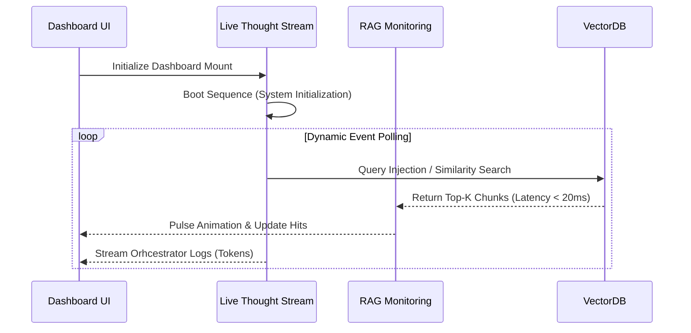

# FRONTEND ARCHITECTURE & LOGIC TOPOLOGY

## 1. COMPONENT TOPOLOGY
The Dashboard (`apps/frontend/src/app/page.tsx`) is a Next.js application composed of three primary functional widgets running synchronously to monitor the AI Engine:
1. `LiveThoughtStream`: An event-driven log terminal rendering system states, sub-agent dispatches, and RAG ingestion logs.
2. `RAGMonitoring`: A visual network topology graph rendering retrieval latencies and Vector Database hits using SVG and Framer Motion.
3. `MasterPlanWidget`: A state machine tracker visualizing architectural Phase completion.

## 2. DATA FLOW (ORCHESTRATION PIPELINE)
The UI does not just display static data; it reflects the underlying deterministic Cognitive Loop:

## 3. UI STATE MANAGEMENT (VIBE MODE)
* **Animation Engine:** `framer-motion` is utilized to maintain UX fluidity and physical depth (Glassmorphism). Hard UI shifts are strictly avoided.
* **State Lifecycle:** Hooks (`useState`, `useEffect`) manage cyclic data without the need for heavy global stores (like Redux), keeping the React tree optimized.
* **Memory Safety:** Logs in `LiveThoughtStream` are capped via `.slice(-20)` to prevent DOM bloat and browser memory leaks over long-running sessions.
