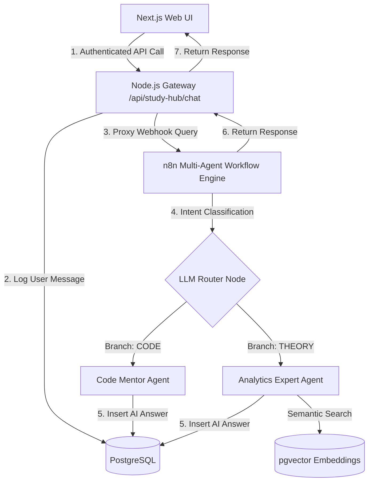

# Phase 11: n8n Automation Workflows Integration Design Blueprint

This document details the blueprint for local n8n workflow integration as the centralized multi-agent automation engine, routing frontend Study Hub chats through Node.js orchestrator secure gateways down to n8n decision pipelines, backed by PG Vector and automatic session logging.

---

## 1. Architectural Overview

Rather than connecting the client web browser directly to n8n webhooks, the system implements a secure gateway bridge to enforce access control:



---

## 2. Hardened Safety & Operational Protocols

### A. n8n Operational Mode (Local CLI vs. Docker)
* **Operational Mode:** Run n8n natively in the Windows environment.
* **Pre-Installation:** We add a global check inside the repository setup script [bootstrap.ps1](file:///c:/Git%20cua%20tui/Ai-Agent/scripts/bootstrap.ps1) to pre-install n8n globally: `npm install -g n8n`.
* **Execution:** We start n8n instantly inside [start_all.ps1](file:///c:/Git%20cua%20tui/Ai-Agent/start_all.ps1) using the global CLI command `n8n start`. This avoids runtime package download blocks.

### B. Gateway Error & Timeout Recovery
* In `POST /api/study-hub/chat`, the user message is saved to PostgreSQL, and then the request is proxied to n8n.
* If n8n times out, crashes, or is not running, the Node.js orchestrator catches the error.
* The orchestrator **persists a system-error fallback row** in the database (`sender_type: 'ai'`, `agent_type: 'system_error'`, `message: "Failed to communicate with local automation workflows. Please verify n8n is running."`).
* This maintains database timeline alignment (every user query has a corresponding response block) and cleanly reports connection issues on the frontend UI without throwing unhandled server crashes.

### C. Database Synchronization
* Exposing the `ChatHistory` model to Prisma and running `npx prisma db push` will **automatically create the `chat_history` table in PostgreSQL** if it doesn't exist. This replaces manual SQL migrations and ensures consistent database structure.

---

## 3. Detailed Component Plan

### A. Database Model & Type-Safety Integration
We must map the database `chat_history` table (defined in `schema.sql`) to Prisma to allow secure orchestrator query resolution.

* **Target:** [schema.prisma](file:///c:/Git%20cua%20tui/Ai-Agent/apps/orchestrator/prisma/schema.prisma)
* **Model Addition:**
```prisma
model ChatHistory {
  id         String   @id @default(uuid())
  sessionId  String   @map("session_id")
  senderType String   @map("sender_type")
  agentType  String?  @map("agent_type")
  message    String
  createdAt  DateTime @default(now()) @map("created_at")

  @@map("chat_history")
}
```

---

### B. Gateway Routing (Secure Endpoint Proxy)
* **Target:** [server.ts](file:///c:/Git%20cua%20tui/Ai-Agent/apps/orchestrator/server.ts)
* **Endpoints:**
  1. `POST /api/study-hub/chat`:
     * Authenticated and rate-limited.
     * Inserts User message row: `senderType: 'user'`, `message`.
     * Proxies payload to `POST http://localhost:5678/webhook/chat`.
     * **Success:** Receives AI answer payload, inserts AI message row: `senderType: 'ai'`, `message`, `agentType`.
     * **Timeout/Error:** Inserts fallback system-error row: `senderType: 'ai'`, `agentType: 'system_error'`, `message`.
     * Returns answer to Next.js.
  2. `GET /api/study-hub/history/:sessionId`:
     * Queries PostgreSQL via Prisma `dbService.client.chatHistory.findMany()` filtered by `sessionId` and sorted by `createdAt` asc.
     * Returns the structured chat timeline.

---

### C. n8n Workflow Schema Realignment
Align the LangChain Postgres logger nodes inside the exported backup schema with our SQL columns.

* **Target:** [workflow_ai_study_hub.json](file:///c:/Git%20cua%20tui/Ai-Agent/docs/vault/tech-stack/turing-hub/integrations/n8n/workflow_ai_study_hub.json)
* **Node Modification:**
  * **Table Target:** `chat_history`
  * **Columns Mapping:** Modify legacy columns to map to: `session_id`, `sender_type`, `agent_type`, `message`.
  * **Values Mapping:**
    * `session_id` = `{{ $('Webhook (Frontend)').item.json.body.sessionId }}`
    * `sender_type` = `'ai'`
    * `agent_type` = `{{ $('Webhook (Frontend)').item.json.body.agent }}`
    * `message` = `{{ $json.output }}`

---

### D. Frontend Ingress Synchronization
Update the Study Hub screen to utilize the secure orchestrator endpoint and restore histories.

* **Target:** [page.tsx](file:///c:/Git%20cua%20tui/Ai-Agent/apps/frontend/src/app/study-hub/page.tsx)
* **Session Restore:** Fetch `GET /api/study-hub/history/:sessionId` in `useEffect` on component mount to dynamically reload past conversations.
* **Bridge Redirection:** Submit messages via the secure `/api/study-hub/chat` gateway.

---

### E. Service Startup Trigger Integration
* **Targets:** [bootstrap.ps1](file:///c:/Git%20cua%20tui/Ai-Agent/scripts/bootstrap.ps1) and [start_all.ps1](file:///c:/Git%20cua%20tui/Ai-Agent/start_all.ps1)
* **Script Integration:** 
  * Append global package check in `bootstrap.ps1`: `npm install -g n8n`.
  * Append background launch command in `start_all.ps1`: `n8n start`.

---

## 4. Verification & Testing

### Automated Integrations Suite (`n8n.test.ts`)
* Create `apps/orchestrator/src/test/n8n.test.ts`.
* **Zero-Dependency Webhook Mocking:** The local n8n HTTP webhook will be mocked by stubbing the Node.js global `fetch` object inside the test file:
```typescript
const originalFetch = global.fetch;
global.fetch = async (url: any, options: any) => {
  if (url.includes('/webhook/chat')) {
    return {
      ok: true,
      json: async () => ({ output: "Mocked n8n response text." })
    } as any;
  }
  return originalFetch(url, options);
};
```
* **Coverage Scope:**
  * Verifies database transaction insertions for sender types.
  * Verifies n8n connection timeout/error recovery: mocks fetch failure, checks that database creates the fallback `system_error` record correctly, and checks that server returns clean responses.
  * Verifies history queries sorted chronologically.

### Manual Verification
1. Run `.\scripts\bootstrap.ps1` to ensure `n8n` is installed.
2. Launch all services via `.\start_all.ps1`.
3. Open n8n interface at `http://localhost:5678`, import the realigned workflow json, and configure the OpenAI/Gemini credential values.
4. Submit chats through the Turing Hub client UI, and verify database rows are populated correctly.
5. Reload the page to confirm the conversation state is restored.
