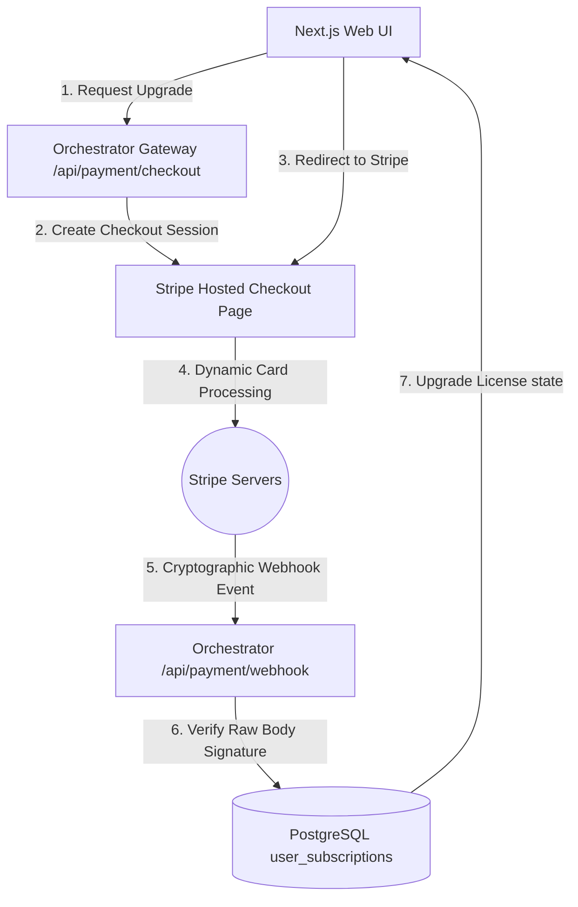

# Phase 12: Stripe Payment Gateway Integration Design Blueprint

This document details the blueprint for local-first subscription licensing and payment gateway integration using **Stripe Checkout** redirections, raw buffer webhook signature verifications, type-safe database schemas, and client settings upgrade portals.

---

## 1. Architectural Overview

The Stripe integration coordinates secure checkout redirections and webhook processing tunnels to govern local subscription states:



---

## 2. Hardened Webhook Raw Body Solution

Stripe webhook validation requires the *exact, unparsed raw body buffer* to construct cryptographic events and verify signatures. We resolve this by configuring standard Express JSON middleware globally with a custom `verify` buffer collector **mounted before all express routing definitions**:

```typescript
const app = express();
app.use(cors({ origin: env.CORS_ORIGIN }));

// MUST be mounted first to catch raw buffers on webhook routes
app.use(express.json({
  verify: (req: any, res, buf) => {
    if (req.originalUrl.startsWith('/api/payment/webhook')) {
      req.rawBody = buf;
    }
  }
}));
```
This binds the raw payload to `req.rawBody` for webhook verification while keeping the rest of the Express REST routes completely standard.

---

## 3. Local-First Offline Policy

To avoid complex license key files or copy exploits, the following local offline policy is enforced:
* **Online Mode:** Subscription parameters sync dynamically via Stripe Webhooks and are cached in PostgreSQL.
* **Offline Grace Period:** When the application runs offline, the cached database status remains valid for a maximum of **30 days** from the last verified online sync date (`lastVerifiedAt`).
* **Exceeded Limits:** If the machine remains offline for **> 30 days**, the Web UI restricts access to premium dashboard widgets (e.g. GraphRAG visualizers) and displays a soft prompt: *"Turing Hub has been offline for over 30 days. Please connect to the internet momentarily to verify license status."*
* **Operational Safety Core:** Host machine physical FlaUI automations and core database operations are **never restricted** under any offline conditions.

---

## 4. Detailed Component Plan

### A. Database Model & Type-Safety Integration
We introduce a one-to-one subscription relation linked to the core admin accounts, documenting valid `stripeStatus` values inside database comments.

* **Target:** [schema.prisma](file:///c:/Git%20cua%20tui/Ai-Agent/apps/orchestrator/prisma/schema.prisma)
* **Model Modifications:**
```prisma
model User {
  id           String            @id @default(uuid())
  email        String            @unique
  password     String
  sessions     Session[]
  goals        UserGoal[]
  subscription UserSubscription?
  createdAt    DateTime          @default(now())
  updatedAt    DateTime          @updatedAt
}

/// Stores subscription parameters synced from Stripe.
/// Valid stripe_status values: 'active' | 'trialing' | 'past_due' | 'canceled'
model UserSubscription {
  id                 String   @id @default(uuid())
  userId             String   @unique
  user               User     @relation(fields: [userId], references: [id], onDelete: Cascade)
  stripeCustomerId   String?  @unique @map("stripe_customer_id")
  stripePriceId      String?  @map("stripe_price_id")
  stripeStatus       String?  @map("stripe_status") 
  currentPeriodEnd   DateTime? @map("current_period_end")
  lastVerifiedAt     DateTime @default(now()) @map("last_verified_at") // Tracks offline grace periods
  createdAt          DateTime @default(now()) @map("created_at")
  updatedAt          DateTime @updatedAt @map("updated_at")

  @@map("user_subscriptions")
}
```

---

### B. Gateway Routing (Secure Checkout & Webhook Proxy)
* **Target:** [server.ts](file:///c:/Git%20cua%20tui/Ai-Agent/apps/orchestrator/server.ts) and [payment.controller.ts](file:///c:/Git%20cua%20tui/Ai-Agent/apps/orchestrator/src/controllers/payment.controller.ts)
* **Endpoints:**
  1. `POST /api/payment/checkout`:
     * Authenticated and rate-limited.
     * Generates a checkout session matching standard premium pricing tiers.
     * Returns the Stripe Checkout URL.
  2. `POST /api/payment/webhook`:
     * Public raw webhook endpoint.
     * Processes raw buffer signatures against the webhook secret using `stripe.webhooks.constructEvent()`.
     * Handles `checkout.session.completed`, `customer.subscription.updated`, and `customer.subscription.deleted`, setting `lastVerifiedAt = new Date()`.
  3. `GET /api/payment/subscription`:
     * Authenticated endpoint checking active plans and expiration states, calculating if the system has exceeded the **30-day offline threshold**.

---

### C. UI Upgrades Settings Panel
* **Target:** Create `profile-billing.tsx` and integrate inside `apps/frontend/src/app/profile/page.tsx`.
* **Visuals:** Renders high-fidelity card upgrade interfaces, tier benefit outlines, and direct portal hooks styled inside cohesive HSL slate themes. Handles soft warnings if offline duration exceeds 30 days.

---

### D. Environments Secrets Hardening
* **Target:** [env.ts](file:///c:/Git%20cua%20tui/Ai-Agent/apps/orchestrator/src/config/env.ts)
* **Variables:**
  * `STRIPE_SECRET_KEY`
  * `STRIPE_WEBHOOK_SECRET`
  * `STRIPE_PRICE_ID`

---

## 5. Verification & Testing

### Automated Integrations Suite (`payment.test.ts`)
* Create `apps/orchestrator/src/test/payment.test.ts`.
* **Realistic Signature Construction:** We will generate valid test webhook signatures using standard Stripe SDK tool:
```typescript
const signature = stripe.webhooks.generateTestHeaderString({
  payload: rawBodyString,
  secret: env.STRIPE_WEBHOOK_SECRET,
});
```
* **Coverage Scope:**
  * Gateway routing generating valid Stripe Checkout redirection objects.
  * Webhook validation stubbing raw buffers, checking signature constructs and database updates.

### Manual Verification
1. Run Stripe local webhook triggers:
   `stripe listen --forward-to localhost:4000/api/payment/webhook`
2. Upgrade through the settings billing panel, fill checkout forms, and confirm the status upgrade is reflected across settings tabs on dashboard refreshes.
